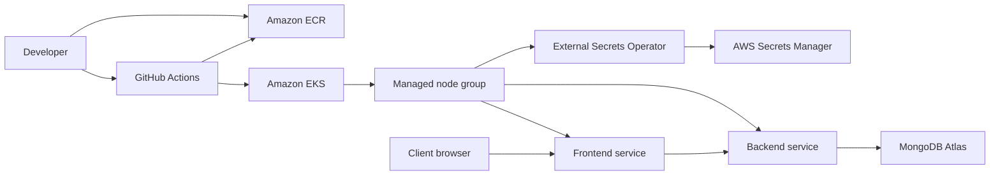

# Cost-Optimized DevOps Showcase

This repo packages a two-service Docker app into a client-ready DevOps showcase:

- Frontend container
- Backend container
- MongoDB Atlas database
- Kubernetes deployment with Helm
- Amazon EKS managed Kubernetes
- Amazon ECR image repositories
- AWS Secrets Manager app env storage
- Terraform infrastructure
- GitHub Actions deployment workflow
- Cost optimization and Upwork portfolio notes

## Why This Project Sells

The strongest Upwork positioning is:

> I containerized and deployed a microservice app with Terraform, Kubernetes, CI/CD, monitoring-ready manifests, secure MongoDB Atlas configuration, rollback support, and a cost-optimized cloud footprint.

This is more sellable than a plain Docker deployment because it demonstrates the skills buyers commonly pay for: Kubernetes, Terraform, CI/CD, cloud cost control, and production deployment hygiene.

## Architecture



## Fast Start

1. Copy the environment template:

```bash
cp .env.example .env
```

2. Put your real images in `.env`:

```env
FRONTEND_IMAGE=123456789012.dkr.ecr.us-east-1.amazonaws.com/devops-showcase/frontend:latest
BACKEND_IMAGE=123456789012.dkr.ecr.us-east-1.amazonaws.com/devops-showcase/backend:latest
MONGODB_URI=mongodb+srv://...
```

3. Run locally:

```bash
chmod +x scripts/*.sh
./scripts/check-prereqs.sh
docker compose up -d
```

4. Deploy infrastructure:

```bash
cd infra/aws-eks
cp terraform.tfvars.example terraform.tfvars
terraform init
terraform apply
aws eks update-kubeconfig --region us-east-1 --name devops-showcase
```

5. Store runtime envs in AWS Secrets Manager:

```bash
AWS_SECRET_NAME=$(terraform output -raw app_env_secret_name)
aws secretsmanager put-secret-value \
  --secret-id "$AWS_SECRET_NAME" \
  --secret-string '{"MONGODB_URI":"mongodb+srv://..."}'
```

6. Push your existing local images to ECR:

```bash
FRONTEND_ECR_URL=$(terraform output -raw frontend_ecr_repository_url)
BACKEND_ECR_URL=$(terraform output -raw backend_ecr_repository_url)
IMAGE_TAG=demo

cd ../..
./scripts/retag-push-ecr.sh \
  --frontend-local-image "local-frontend:latest" \
  --backend-local-image "local-backend:latest" \
  --frontend-ecr-url "$FRONTEND_ECR_URL" \
  --backend-ecr-url "$BACKEND_ECR_URL" \
  --tag "$IMAGE_TAG" \
  --aws-region us-east-1
```

7. Deploy to Kubernetes after the EKS cluster is ready:

```bash
FRONTEND_ECR_URL=$(cd infra/aws-eks && terraform output -raw frontend_ecr_repository_url)
BACKEND_ECR_URL=$(cd infra/aws-eks && terraform output -raw backend_ecr_repository_url)
EXTERNAL_SECRETS_ROLE_ARN=$(cd infra/aws-eks && terraform output -raw external_secrets_role_arn)
AWS_SECRET_NAME=$(cd infra/aws-eks && terraform output -raw app_env_secret_name)

./scripts/deploy.sh \
  --namespace showcase \
  --frontend-image "$FRONTEND_ECR_URL:$IMAGE_TAG" \
  --backend-image "$BACKEND_ECR_URL:$IMAGE_TAG" \
  --cluster-name devops-showcase \
  --aws-region us-east-1 \
  --aws-secret-name "$AWS_SECRET_NAME" \
  --install-ingress-controller \
  --install-external-secrets \
  --external-secrets-role-arn "$EXTERNAL_SECRETS_ROLE_ARN"
```

## Repo Map

- `.github/workflows/deploy.yml`: manual GitHub Actions deployment using your existing Docker images
- `scripts/retag-push-ecr.sh`: retag existing local Docker images and push them to ECR
- `docker-compose.yml`: local demo with MongoDB Atlas connection
- `helm/microservice-showcase`: Kubernetes Helm chart for frontend and backend
- `infra/aws-eks`: Terraform for a cost-conscious EKS cluster and managed node group
- `scripts/check-prereqs.sh`: Linux VM tool checker
- `COST_OPTIMIZATION.md`: cost decisions and upgrade path
- `UPWORK_PORTFOLIO.md`: client-facing story, gig title, and proposal copy

## GitHub Actions Setup

Add these repository secrets:

- `AWS_ACCESS_KEY_ID`
- `AWS_SECRET_ACCESS_KEY`

Add these repository variables:

- `AWS_REGION`: example `us-east-1`
- `EKS_CLUSTER_NAME`: example `devops-showcase`
- `AWS_SECRET_NAME`: example `devops-showcase/app/env`
- `EXTERNAL_SECRETS_ROLE_ARN`: output from `terraform output -raw external_secrets_role_arn`

Then run the `Deploy Existing Images` workflow manually with your ECR frontend image, ECR backend image, and ingress host.

## Production Upgrade Path

For a real client, the same app can be upgraded from this demo architecture to:

- Multi-AZ private VPC networking
- Multi-node autoscaling
- External Secrets Operator
- Prometheus and Grafana dashboards
- Centralized logs
- Blue-green or canary deployments
- WAF, CDN, and managed TLS
