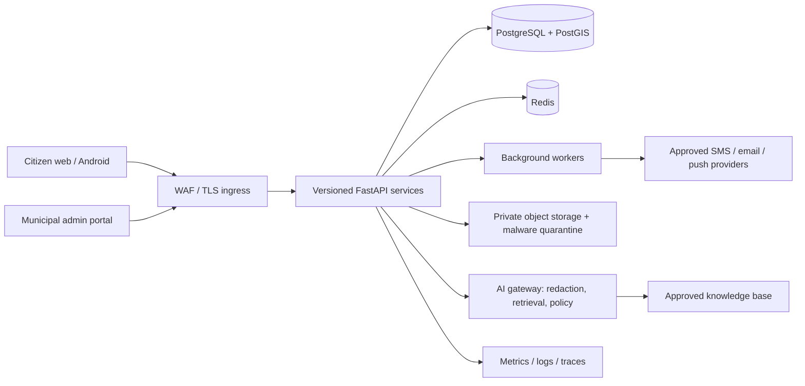

# Platform architecture

One codebase serves a hierarchy of organizations. `organizations.parent_id` models district → taluka → municipality; wards and municipal resources belong to an organization. Every access token and server-side query is bound to an organization and, when relevant, ward or assignment. Parent administrators receive aggregate endpoints and do not inherit access to child citizen records. Database row-level security is a planned defense-in-depth control and must be enabled before production; app authorization alone is not a substitute for review.

Boundaries: API is the authority for identity, policy, workflows and audit. Web and mobile are untrusted clients. Object storage is private and serves short-lived authorized downloads only. Workers process notification, scanning, analytics and report jobs. AI receives minimized/redacted content through an allowlisted gateway and cannot mutate government records. External integrations are adapters with explicit timeouts, retries, idempotency and audit.

Production decisions still required: hosting/data residency, identity proofing and OTP vendor, official service source-of-truth, payment provider, GIS basemap, retention schedule, incident process, SLO/RPO/RTO, and languages/content approval. No example metrics or emergency numbers represent a real municipality.
