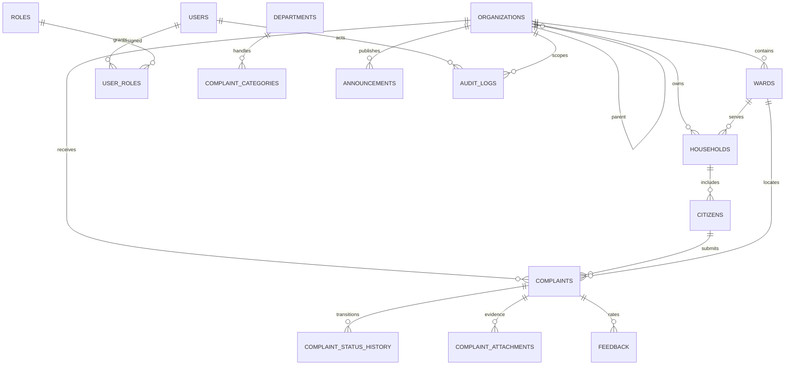

# Data model and ER overview

UUID primary keys and UTC timestamps are used. JSONB multilingual fields hold locale-keyed display strings; identifiers, status and ownership remain typed columns. Phone numbers are E.164 and must be masked in logs and ordinary staff views. Attachments store private object keys, never public URLs. Payment records store provider references and amount/status only, never PAN, CVV, PIN or payment credentials.

The initial Alembic migration is `apps/api/migrations/versions/0001_platform_foundation.py`. It covers organization hierarchy, ward, household, citizen, RBAC, complaints/history/attachments, announcements, documents, services/applications, payment references, schemes, contacts, emergency contacts, field visits, feedback, notifications, audit/security/AI and import jobs. Indexes cover tenant+ward complaint queues, category trends, geospatial queries, user notifications and audit timelines. The migration installs PostGIS and enforces row-level policies using the transaction-local `app.organization_id`; authenticated request and worker code must set this value from a verified principal before querying tenant tables. Apply PostGIS before deploying the migration.

Keep audit rows append-only; ship an independently controlled copy to immutable storage for tamper evidence. Apply retention and deletion workflows by data class. Before importing live registers, add dedupe/review and data-quality rules, field-level access policies and tenant isolation tests. Never implement a bulk unscoped citizens endpoint.
