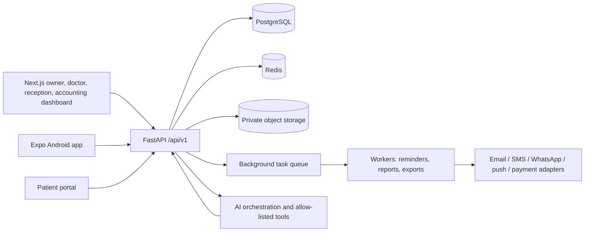
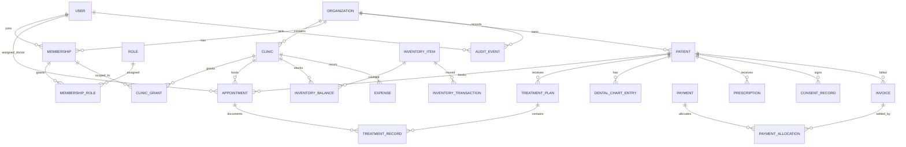

# DentalCare / ClinicOS architecture

Status: Phase 1 foundation. Product name, tenant branding, and clinic identity are configuration, not code constants.

## Product scope and assumptions

The first tenant is one dental organization with three clinics. The data model separates the organization from its clinics so that additional independent organizations can use the SaaS later. A person may belong to more than one organization; a membership grants roles, while clinic grants constrain where those roles apply. Clinic grants and role grants are distinct: clinic-scoped role grants name the clinic, while explicit organization roles such as owner can span all clinics that the member is granted. Patients are organization-wide identities and may receive care at multiple clinics in that organization. Clinical, scheduling, inventory, and financial records carry an organization and, where they are operationally clinic-specific, a clinic foreign key.

Unspecified decisions to settle before production: operating country and applicable health/privacy rules; hosting/data residency; patient identity and guardian rules; retention and deletion schedules; local tax/invoice rules; payment, SMS, email, WhatsApp BSP, and identity providers; consent language; backup RPO/RTO; and whether patient self-booking is enabled. Do not put real patient data in development or demo environments.

## Architecture overview

Use a modular monolith initially: one versioned API, one PostgreSQL database, separate worker process, and domain modules with explicit service boundaries. This keeps deployment and transactions tractable while enabling later extraction of high-volume modules. PostgreSQL is the source of truth; Redis is disposable cache/queue/lock state. Store files in private object storage, with short-lived signed URLs and authorization before URL issuance.

### Security and data boundaries

- `organization_id` is the tenant boundary; `clinic_id` is the operational scope. Never accept either as authorization merely because a client supplied it.
- Authenticate the user, resolve active organization membership, authorize the action and requested clinic, then scope every repository query. Clinic owners still require a membership/grant for each clinic.
- Use PostgreSQL row-level security as defense in depth after the application authorization layer is established. Set tenant/clinic session variables transaction-locally; never use connection-global tenant state with pooling.
- Composite foreign keys should prevent linking records across organizations (for example `(organization_id, clinic_id)`); unique constraints should include the correct tenant key. Audit denied cross-tenant access without leaking whether a foreign record exists.
- Do not put patient-identifying data in analytics events, logs, AI prompts, push previews, or URLs. Encrypt transport and managed storage; use field-level encryption only for explicitly classified fields and retain key rotation/decryption operational procedures.
- Public onboarding links are random, one-use/limited-use, purpose-scoped, expiring tokens stored as hashes. They never grant general portal or clinic access. Complete identity verification/OTP before sensitive data can be read or submitted.
- Clinical records are append-only/versioned. Corrections are amendments with author, timestamp, reason, and immutable audit history. Consent records include the exact version presented and signature evidence.
- Financial entries are append-only ledger events; corrections use reversal/refund/adjustment entries. Amounts are integer minor units plus ISO currency, never floating point. Payment success comes only from verified server-side provider webhooks.
- AI tools are allow-listed typed functions with authorization, Zod/Pydantic validation, minimal response fields, and confirmation gates for mutations. AI is administrative support and dentist-supervised clinical assistance, never autonomous diagnosis or prescribing.

### Database ER diagram (foundation and target domains)

All tenant-owned rows include `organization_id`; clinic-operational rows include `clinic_id`. Normalize users, organizations, clinics, memberships, roles, permissions, clinic grants, patients, appointments, treatments, chart entries, prescriptions, consents, documents, invoices, payments/allocations, expenses, inventory items/batches/transactions, suppliers/purchase orders, messages/conversations, notification preferences/deliveries, follow-ups, campaigns, AI sessions/actions, and audit events. Add indexes for tenant + clinic + common filter/sort columns and PostgreSQL full-text/trigram search after measuring real data patterns.

## API architecture

REST under `/api/v1`, OpenAPI generated from FastAPI. Standard success envelope `{success:true,data,message,meta}` and error envelope `{success:false,error:{code,message,fields?},request_id}`. Use cursor pagination for large collections, idempotency keys for writes that may be retried, UTC timestamps, explicit ISO currency, and optimistic concurrency/version fields for editable records. Return generic not-found/forbidden responses when a resource may belong to another tenant.

Domains: `/auth`, `/organizations`, `/clinics`, `/memberships`, `/users`, `/patients`, `/appointments`, `/treatments`, `/dental-chart`, `/prescriptions`, `/consents`, `/documents`, `/invoices`, `/payments`, `/expenses`, `/inventory`, `/suppliers`, `/notifications`, `/conversations`, `/promotions`, `/followups`, `/reports`, `/ai`, `/voice`, `/audit`. Keep provider webhooks isolated and signature-verified. Appointment booking uses a transaction, an exclusion/unique constraint on provider + time range, and retries a bounded conflict response; client-side availability is advisory only.

## Authentication and authorization

Use short-lived signed access tokens and rotating opaque refresh tokens stored hashed server-side, with session revocation, family-wide reuse detection, rate-limited login, Argon2id password hashing, secure HttpOnly/SameSite cookies for web, and secure OS-backed storage for mobile. OIDC and OTP can be added through provider adapters. Roles are organization membership grants: `SUPER_ADMIN`, `CLINIC_OWNER`, `DOCTOR`, `DENTIST`, `RECEPTIONIST`, `ACCOUNTANT`, `INVENTORY_MANAGER`, `STAFF`, `PATIENT`; granular permissions map to actions/resources, and clinic-scoped role grants name the clinic. `SUPER_ADMIN` is platform-scoped and should use audited break-glass access, not ordinary patient browsing. Patient access uses a separate principal/limited scope.

## Navigation

### Web

- Overview (clinic selector; combined or one clinic)
- Schedule (calendar, queue, availability)
- Patients (directory, profile, chart, records, documents)
- Clinical (treatment plans, procedures, prescriptions, consents)
- Finance (invoices, payments, expenses, reports)
- Inventory (stock, batches/expiry, transfers, suppliers, purchase orders)
- Inbox (patient conversations, notifications)
- Insights (clinic comparisons, reports, exports)
- Campaigns (consented promotions and review requests)
- Team (doctors, staff, memberships, access)
- Settings (clinic, hours, catalog, integrations, privacy, security)

### Mobile

Role-aware bottom tabs: Home, Schedule, Patients/Queue, Inbox, More. Owner home adds clinic selector, metrics and quick actions. Doctor patient flow: appointment → patient summary → chart/history → note/treatment/prescription/follow-up. Reception flow: search/register → book/check in → collect payment. Inventory scan is a distinct quick action. Patient portal is a separated route/surface with only patient-scoped appointments, plans, documents, invoices, payments, questions, profile, and preferences.

Expo Router with typed route groups; Redux Toolkit + RTK Query; Zod + React Hook Form; secure token storage; local encrypted cache limited to recent assigned schedule/patients. Offline writes remain drafts/queued commands with idempotency keys and visible pending state; server revalidates permissions and conflicts before commit. Never queue payment capture, consent signing, or other high-risk clinical/legal mutations for silent sync.

## AI and voice

Flow: authenticated user → speech-to-text (provider adapter, explicit mic permission) → typed intent extraction → validation → permission-scoped tool → preview/confirmation when mutating → ordinary domain service → audit record → concise response/text-to-speech. AI cannot construct arbitrary SQL or access the database directly. Tools include appointment lookup/slot search, revenue aggregates, expiring/low stock, follow-ups, and draft generation. Clinic and date range are explicit tool arguments and checked against grants. Separate administrative retrieval from dentist-supervised clinical decision support. Minimize/redact prompts, define retention, and allow disabling AI per organization.

## Notification architecture

Domain events outbox written in the same database transaction as the change → queue dispatcher → channel adapter (push, WhatsApp Business BSP, SMS, email) → delivery webhook/status reconciliation → communication log. Templates, locale, quiet hours, consent/preferences, opt-out, deduplication/idempotency, retry/backoff, rate limits, and per-channel provider config are centralized. Transactional care messages and marketing consent are distinct. Reminders and expiry/low-stock checks are background jobs; failure must be observable and retryable.

## Deployment and operations

The current local compose foundation runs the API, PostgreSQL, Redis, and worker; the Next.js web app and Expo app run with their framework development commands. Add a web container when a reproducible lockfile and release build are established. Production target: AWS ECS/Fargate initially (simpler operations than EKS for the modular monolith), RDS PostgreSQL Multi-AZ, ElastiCache Redis, private S3 + KMS, CloudFront for static web, ALB/WAF, Route 53, Secrets Manager, CloudWatch/OpenTelemetry. EKS only when operational scale justifies it. Use IaC, immutable images, CI gates, staged migrations, TLS, least-privilege IAM, private subnets, PITR and tested encrypted backups, restore drills, retention controls, alerting, and documented incident response. Do not claim a compliance certification without assessment and evidence.

## Milestones

1. **Foundation (current):** architecture, tenant model, authentication/session primitives, RBAC/clinic grants, health/versioned API, migrations and local containers.
2. **Operations:** patient identity/profile, deduplication, secure onboarding, doctor/staff directory, scheduling/availability and concurrency protection.
3. **Clinical:** append-only notes, treatment plans/records, tooth chart, prescriptions, consent/versioning and private documents.
4. **Finance:** invoices, immutable payments/allocations/refunds, verified gateway webhooks, expenses, receipts and reconciliations.
5. **Inventory:** batches/stock ledger, transfers, purchase orders, supplier balances, barcode, expiry/low-stock jobs.
6. **Patient access and messaging:** portal, secure chat, notification outbox/providers, consent and reminders.
7. **AI/voice:** authorized read tools, draft generation, confirmation-gated actions, audit and privacy controls.
8. **Analytics:** factual clinic comparisons, reports, exports, controlled aggregation and performance tuning.
9. **Hardening:** threat modeling, tenant isolation tests, security review, load/concurrency tests, observability, backup/restore drills and accessibility.
10. **Launch:** jurisdiction-specific privacy/legal review, production infra, pilot migration, staff training, support runbooks, Android AAB/APK and web release.

## Phase 1 API and data contracts

- `POST /api/v1/auth/login` → access token + refresh session; generic authentication errors.
- `POST /api/v1/auth/refresh` → rotate refresh token; detect reuse.
- `POST /api/v1/auth/logout` → revoke current session.
- `GET /api/v1/auth/me` → user, active organization memberships, roles and clinic grants.
- `GET /api/v1/clinics` → only clinics granted to active membership.
- `GET /health/live`, `GET /health/ready` → liveness/readiness; readiness checks required dependencies without returning secrets.

Phase 1 does not provision passwords, real clinics, or demo patient data. Bootstrap is a separate one-time administrative operation with auditable credential setup.
